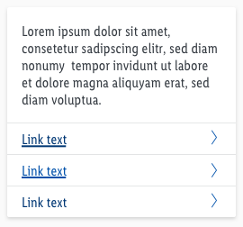
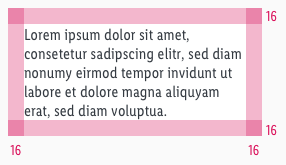
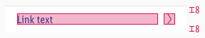

<AlertInfo alertHeadline="Modifiable">
Please ensure to comply with the corporate identity. A detailed list what can be modified can be found [here](#what-can-be-modified).
</AlertInfo>

# Button list

The button list is a possible respond option of the chatbot to offer the user information to his question.
The bot can provide the user several links.

It is based on the design of the [CAKE product tile](/Lidl/Web/Design/Components/Product_tile/Product_tile.md).

---

## General information

- The button list is divided into a content and button area.
- The content area can contain images, headlines and text in various styles. This area provides more detailed information on a specific topic.
- The button area contains links. In this area, the user can take action and response to the given information.
- The button list offers two interaction forms:
  1. By clicking a link the user leaves the conversation and a new tab is opened.
  1. By clicking a link the user stays in the chat window and the bot offers him a more detailed answers in a new respond element (e.g. quick replies, card, image, etc.).

---

## Usage

- Choose a descriptive button text, so the user knows what to expect behind the link.
- The button text should be single-line or a maximum of two lines.

---

## Overall styling

- The text-style is [basic](../../../../Web/Design/General/Typography/Typography.md#basic).
- The line-height is **120%**.
- The default text-color is **gray-darker**.
- The default link is our [link positive](../../../../Web/Design/General/Link/Link.md#positive-version) one.
- The text-style is [basic](../../../../Web/Design/General/Typography/Typography.md#bold).
- The line-height is **120%**.
- The default text-color is **gray-darker**.
- The default link-color is **brand-primary-base** and has text decoration **underline**.
- The components has **rounded corners of 2px**.
- The icon is **arrow-right** and the color is **brand-primary-base**.
- The divider height is **1px** and the color is **gray-lighter**.
- Every state uses the **shadow-default**.
- The height of the button list depends on the content in the text box and the additional links below.
- All widths are fixed and aligned to the layout grid of the breakpoints.

---

## Spacing & measurements

| Types | Attributes | Preview |
|---|---|---|
| Overall padding   content area | 16px |  |
| Horizontal spacing | padding: 16px   text to icon: 8px |  |
| Vertical spacing | padding: 8px |  |
| Icon size | 16 x 16px |  |

---

## What can be modified?

- Override the text and modify the text-style (regular, bold, italic text).
- Adjust the height.
- Add or delete the amount of links.
- Add ordered list or line break list in the text box area.
