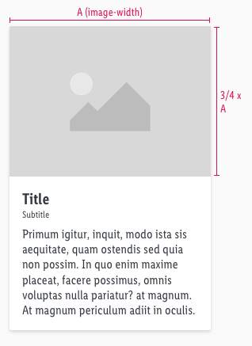
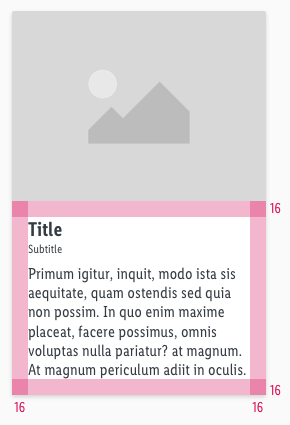

<AlertInfo alertHeadline="Modifiable">
Please ensure to comply with the corporate identity. A detailed list what can be modified can be found [here](#what-can-be-modified).
</AlertInfo>

# Card

The card is a possible respond option of the chatbot to offer the user information to his question.

It is based on the design of the [CAKE product tile](/Lidl/Web/Design/Components/Product\ tile/Product\ tile.md).

---

## General information

- The card offers **image**, **title**, **subtitle** and **body-text** to give the user necessary information about a certain topic.

---

## Overall styling

- The text-style of the title is [large bold](../../../../Web/Design/General/Typography/Typography.md#large-bold).
- The line-height is **120%**.
- The text-style of the subtitle is **small**.
- The text-style of the body-text is **basic**.
- The image ratio always is **4:3**.
- The components has **rounded corners of 2px**.
- Every state uses the **shadow-default**.
- The height depends on the content.
- The width is fixed and aligned to the layout grid of the breakpoints.

---

## Spacing & measurements

| Types | Attributes | Preview |
|---|---|---|
| Image size | Always ratio 4:3 |  |
| Padding | 16px |  |
| Vertical spacing | Title to subtitle: 0 px   Subtitle to Text: 8 px |  |

---

## What can be modified?

- Override the text and image.
- Modify card component to your project needs.
- Adjust the height.
