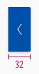
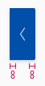
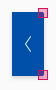

<AlertInfo alertHeadline="Modifiable">
Please ensure to comply with the corporate identity. A detailed list what can be modified can be found [here](#what-can-be-modified).
</AlertInfo>

# Carousel

The carousel is a possible responding option to offer the user a summary of respond blocks at the same time.

---

## General information

- All offers are listed horizontally next to each other.
- Sliding offers is a characteristic feature of this components.
- The carousel contains a various number of respond blocks (e.g. [button list](../Button%20list/Button%20list.md), [card](../Card/Card.md) etc.).
- The overall height depends on the highest element.

---

## Usage

- By clicking on the button of the carousel the user can switch through all block elements.
- Alternativ he can swipe the carousel to see the different blocks.

---

## Overall styling

- The background-color is **brand-primary-base**.
- The icon-color is **basic-white**.
- It uses the **shadow-default**.
- The component has rounded corners of **2px** on one side.
- The button has **no hover/focus or active state**. Only the pointer changes.

---

## Spacing & measurements

| Types | Attributes | Preview |
|---|---|---|
| Height | 64px |  |
| Width | 32px |  |
| Horizontal spacing | padding: 8px |  |
| Icon size | 16x16px |  |
| Rounded corners | 2px   No rounded corners at the screen edge | |

---

## Placement & spacing

- The buttons are placed on the edge of the screen.
- The buttons are placed in mid-level hight of the highest element.
- Padding of 8px between the elements.
- The overall height depends on the highest element.

---

## What can be modified?

- Override the text elements.
- Adjust the height.
- Add or delete the amount of links.
- Add ordered list or line break list in the text box area.
