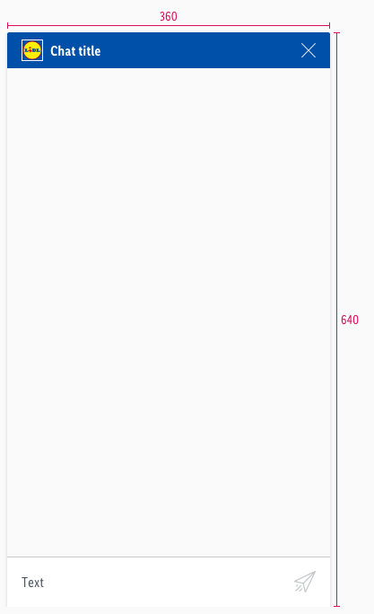

<AlertInfo alertHeadline="Modifiable">
Please ensure to comply with the corporate identity.
</AlertInfo>

# Chat window

The chat window is understood as the background of the chatbot.

---

## Overall styling

- The background-color is **gray-background**.
- It uses **shadow-default**.
- It has rounded corners on the **top-left and -right of 2px**.
- It contains almost every single component of the chatbot.

## Spacing & Measurements

| Types | Attributes | Preview |
|---|---|---|
| Size | 360x640px|  |
