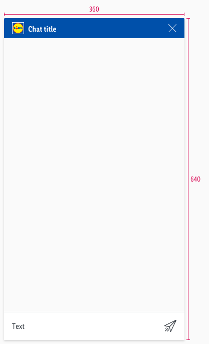

<AlertInfo alertHeadline="Modifiable">
Please ensure to comply with the corporate identity. A detailed list what can be modified can be found [here](#what-can-be-modified).
</AlertInfo>

# Chat window

The chat window is understood as the background of the chatbot.

---

## Overall styling

- The background-color is **gray-background**.
- It uses **shadow-default**.
- It has rounded corners on the **top-left and -right of 2px**.
- It contains almost every single component of the chatbot.

## Spacing & measurements

| Types | Attributes | Preview |
|---|---|---|
| Size | 360x640px|  |

---

## What can be modified?

- Override the text elements.
- Modify chat window to your project needs by adding other symbols like dialog typing and/or dialog user.
