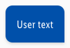
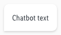
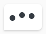
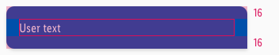
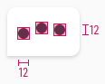

<AlertInfo alertHeadline="Modifiable">
Please ensure to comply with the corporate identity.
</AlertInfo>

# Dialog

These components display the conversation between user and chatbot.

---

## Overall styling

- The text-style is **basic**.
- The typing scenario is an animation in the frontend part (jumping bubbles changing their color), that is styled with the icon-color of **basic-white and -darker**.

| Types | Attributes | Preview |
|---|---|---|
| User | text-color: basic-white background-color: brand-primary-base rounded-corners: 10px 10px 0px 10px | |
| Chatbot | text-color: gray-darker background-color: basic-white rounded-corners: 10px 10px 10px 0px |  |
| Chatbot (typing)| icon-color: gray-darker background-color: basic-white rounded-corners: 10px 10px 10px 0px |  |

---

## Spacing & Measurements

| Types | Attributes | Preview |
|---|---|---|
| Vertical spacing | padding: 16px |  |
| Horizontal spacing | padding: 16px |  |
| Icon size | 12x12px icons are horizontally centered |  |
