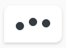
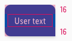
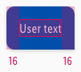
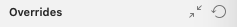

<AlertInfo alertHeadline="Modifiable">
Please ensure to comply with the corporate identity. A detailed list what can be modified can be found [here](#what-can-be-modified).
</AlertInfo>

# Dialog

These components display the conversation between user and chatbot.

---

## Overall styling

- The text-style is [basic](../../../../Web/Design/General/Typography/Typography.md#basic).
- The line-height is set to **default**.
- The typing scenario is an animation in the frontend part (jumping bubbles changing their color), that is styled with the icon-color **gray-darker** and changed into transparency gradations.
- The typing scenario is an animation in the frontend part (jumping bubbles changing their color), that is styled with the icon-color of **basic-white and -darker**.

| Types | Attributes | Preview |
|---|---|---|
| User | text-color: basic-white background-color: brand-primary-base rounded-corners: 10px 10px 0px 10px | |
| Chatbot | text-color: gray-darker background-color: basic-white rounded-corners: 10px 10px 10px 0px |  |
| Chatbot (typing)| icon-color: gray-darker background-color: basic-white rounded-corners: 10px 10px 10px 0px |  |

---

## Spacing & measurements

- The width and the height depends on the content length.

| Types | Attributes | Preview |
|---|---|---|
| Vertical spacing | padding: 16px |  |
| Horizontal spacing | padding: 16px |  |
| Icon size | 12x12px icons are horizontally centered |  |

---

## What can be modified?

- Override the text elements.
- Press the two arrow icon on the override panel to adjust the size of the component.  In Sketch it looks like: 

