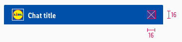

<AlertInfo alertHeadline="Modifiable">
Please ensure to comply with the corporate identity. [What can be modified](#what-can-be-modified)?
</AlertInfo>

# Header

It is used as an introduction to the chatbot and the brand it belongs to.

---

## Overall styling

- The text-style is [basic-bold](../../../../Web/Design/General/Typography/Typography.md#basic-bold).
- The line-height is **120%**.
- The text- and icon-color is **basic-white**.
- The background-color is **brand-primary-base**.
- It comes with **2px** rounded corners on the **top-left and -right**.

---

## Spacing & measurements

| Types | Attributes | Preview |
|---|---|---|
| Vertical spacing | padding: 8px |  |
| Horizontal spacing | padding: 16px margin: 8px |  |
| Height | 40px |  |
| Icon-size | 16x16px |  |
| Logo | Height: 24px |  |

---

## What can be modified?

- Override the chat title element.
