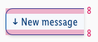

<AlertInfo alertHeadline="Modifiable">
Please ensure to comply with the corporate identity.
</AlertInfo>

# Indicator

The indicator gives the user a notification that the bot has sent a new message, which is located in the lower non-visible area of the chat window.

The chatbot interface **only offers text characters**, therefore a unicode font character was used instead of an icon. The browser automatically uses the system font. In Sketch the font Monaco is used.

---

## Overall styling

- The text-style is **basic**.
- The **arrow** uses the **font Monaco**.
- The font-color is **brand-primary-darker**.
- The background-color is **brand-primary-background**.
- The outline-color is **brand-primary-base**.
- The border has a **thickness of 1px**.
- It has rounded corners on the **top-left and bottom-left of 10px**.
- It uses **shadow-default**.

---

## Spacing & Measurements

| Types | Attributes | Preview |
|---|---|---|
| Vertical spacing | padding: 8px |  |
| Horizontal spacing | padding: 8px |  |
| Height | 37px |  |
| Rounded corners | left: 10px   right: 0px |  |
| Position | 8px |  |
