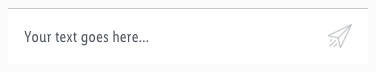

<AlertInfo alertHeadline="Modifiable">
Please ensure to comply with the corporate identity.
</AlertInfo>

# Input field

It gives the user the opportunity to write and send his message.

---

## Overall styling

- The text-style is [basic](../../../../Web/Design/General/Typography/Typography.md#basic).
- The line-height is set to **default**.
- The divider always comes in **gray-light** and has a **height of 1px**.
- The background color is **basic-white**.
- The icon always is **paper-plane.svg** and it follows the rules of [Styling as navigation](/Lidl/Web/Design/General/Icon/Icon.md).

| Types | Attributes | Preview |
|---|---|---|
| Default / active | text-color: gray-darker icon-color: gray-darker | 
| Hover / focus | text-color: brand-primary-base  icon-color: brand-primary-base |  |
| Disabled | text-color: gray-base icon-color: gray-light |  |

## Spacing & measurements

| Types | Attributes | Preview |
|---|---|---|
| Vertical spacing | padding: 16px |  |
| Horizontal spacing | padding: 16px margin: 16px  |  |
| Icon-size | 24x24px   clickable area: 56x56px|  |
