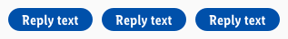
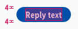

<AlertInfo alertHeadline="Modifiable">
Please ensure to comply with the corporate identity.
</AlertInfo>

# Quick Replies

Quick replies are like short links that offer the user a quick interaction.

It is based on the design of the [CAKE badge](../../../Typography.md).

---

## General information

- The quick reply allows the bot to present multiple or related topics that may also be of interest to the user.
- In addition, the bot can expand the dialog with the user.
- By clicking on a quick answer, the user immediately jumps to a specific topic and receives more detailed information.

---

## Usage

- Keep the user in a conversation loop and offer him new topics.
- In case of a limited response possibility or if the responses are predictable offer.
- To maintain clarity, limit the maximum number of quick replies to a minimum.

---

## Overall styling

- The text-style is always **basic bold**.
- The text-color always is **basic white**.
- The line-height is **120%**.
- The default background-color is **brand-primary-base**.
- The hover background-color changes to **brand-primary-darker**.
- The border is in **basic-white** with a **1px thickness**.
- It always has rounded corners of **50% of its height**.

---

## Spacing & Measurements

| Types | Attributes | Preview |
|---|---|---|
| Horizontal spacing | padding: 16px |  |
| Vertical spacing | padding: 4px |  |
| Horizontal distance | margin: 8px |  |
| Vertikal distance | margin: 8px |  |
