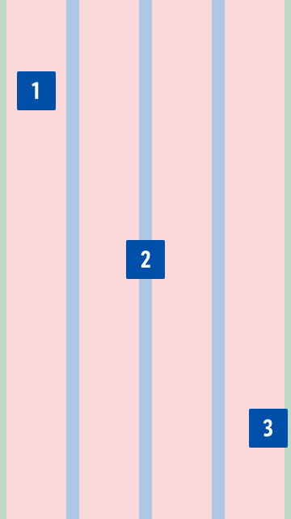
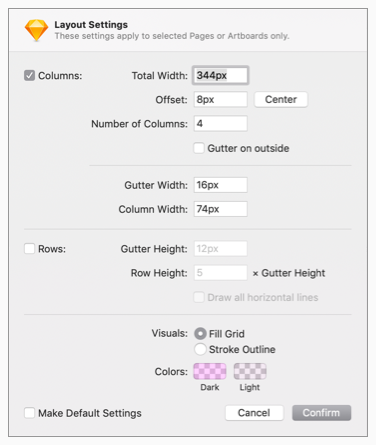

<AlertInfo alertHeadline="Modifiable">
Please ensure to comply with the corporate identity.
</AlertInfo>

# Grid system

A grid system can be used to align and size objects within a given format.

---

## Usage

- Basic rules that help you set up your pages in sketch.

|  1. Columns | 2. Gutters | 3. Margins |
|---|---|---|
| Content is placed in the areas of the screen that contain columns.  The number of displayed columns is determined by the breakpoint that is choosen. | Gutters are the spaces between columns.  They help separate content. | Margins are the space between content and the left and right edges of the screen. |

---

## Settings in Sketch

| Type | Values |
|---|---|
| Artboard | Android |
| Viewport | 640px |
| Columns | 4 columns |
| Gutters | 16px |
| Offset (Margins) | 8px / 8px |
| Layout settings |  |
